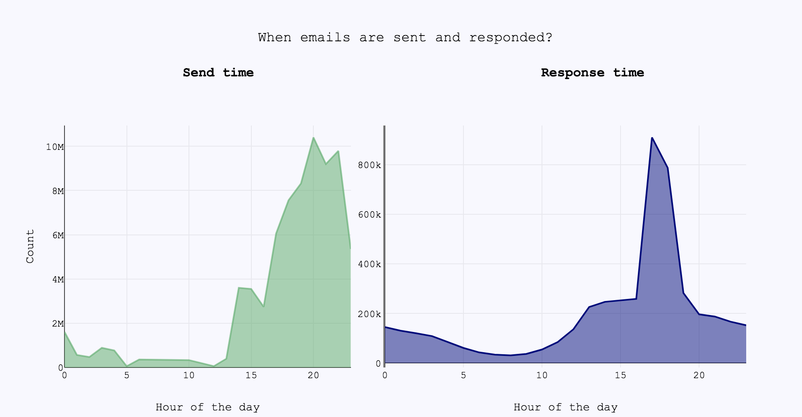

# Research

 

## Multi-armed bayesian bandit for Email Send Time Optimization

The objective of building a reliable Send Time Optimization (STO) engine is the following: send emails to each of the customers with the best possible timing when the customers are the most receptive. Some subscribers prefer to receive newsletters early in the morning, others take the time to scan their inboxes in the evening.  From the sender’s point of view, it is desirable to always deliver at the right time.

Deciding which time slot to send promotional emails is a huge challenge for many companies.

One common approach is to choose different send times and measure the Open Rate (OR) of the emails for each time slot. At some point, when the measured OR for one specific slot exceeds that of the other slots, we will switch to the one with the highest for all customers. Algorithms for solving this problem are called bandit algorithms. For my analysis I implemented a **Multi-Armed Bayesian Bandit Algorithm**.
 

### Approach

The goal of the bandit algorithm is to do the following: display all possible time slots to a random selection of users, and measure in which time slots the emails are opened more frequently. Over time, it will use these observations to infer which send times have the higher OR. Then, once the estimation of the OR becomes more precise, it will preferentially display the time slots with the higher OR.

In our model, we have \\( N \\) possible time slots, each of which has an email open rate \\( \theta_i \\). Unfortunately we do not know what \\( \theta_i \\) is, but we can construct a probability distribution which represents our belief about what the actual value of \\( \theta_i \\) is. This is called a Bayesian Approach.

In Bayesian reasoning, the fundamental goal is to compute a posterior distribution on \\( \theta_i \\). This means we want to find a function \\( f(x) \\) with the property that:

\\[ P(a < \theta_i < b) = \int_a^b f(x) dx \\]

In graphical terms, the probability that \\( a < \theta_i < b \\) can be interpreted as the area under the curve of the graph of \\( f(\theta) \\):

The function \\( f(x) \\) represents our beliefs about \\( \theta_i \\) - it is an inherently subjective matter. It depends on our beliefs about what typical values of \\( \theta_i \\) might be as well as the evidence we have seen. What Bayesian analysis provides us with is an objective method of altering \\( f(x) \\) based on the evidence we have about it.

The basic idea behind Bayesian methods is to update our beliefs based on evidence. As we gather more data by sending emails in different time slots to other users and observing the open rates, we can incrementally narrow the width of the probability distribution.

As in all Bayesian inference, we need to choose a prior. The prior is something we believe to be true before we have any evidence. This is just a starting point - after enough evidence is gathered, our prior will play a very minimal role in what we actually believe. Choosing a good prior is important both for mathematical simplicity, and because if your prior is accurate, you don't need as much evidence to get the correct answer.

If the prior probability distributions are in the same family as the posterior distributions, then they are known as conjugate distributions, and the prior is known as the conjugate prior to the likelihood function. In simpler terms, if we know the distribution of the likelihood function, we can determine the distribution of the posterior and prior.

In our case, since we are measuring a binary outcome (did somebody open or not the email), we know that we are dealing with the Bernoulli distribution, making our likelihood:

\\[ P(X \mid\theta) = \prod_{i=1}^N \theta^{x_i}(1-\theta)^{1-x_i} \\]

The conjugate prior to the Bernoulli distribution is the Beta distribution:

\\[  P(\theta_i=x) = \frac{ x^{\alpha_i-1}(1-x)^{\beta_i-1} }{B(\alpha_i, \beta_i)} \equiv f_{\alpha_i,\beta_i}(x) \\]

The parameters \\( \alpha_i, \beta_i > 1 \\) are the prior parameters. If we considered that all possible values of \\( \theta_i \\) are equally likely, a reasonable choice would have been \\( \alpha_i=\beta_i=1 \\), which amounts to the uniform distribution on \\( [0,1] \\). However, since we have observed past data for our users, we want to incorporate this information into our bandit algorithm. Therefore we fit a beta distribution to our empirical data and build our priors parameters based on the aggregate open rate of all relevant contacts for each bandit (time slot).

After sending emails in the time slot \\( i \\) to \\( n_i \\) contacts, we have observed that \\( s_i \\) of them have actually opened the email in that time slot \\( i \\). Therefore we now want to compute the posterior distribution. Considered our prior \\( f_{\alpha_i,\beta_i}(\theta_i) \\), we can compute the posterior as follows:

\\[ f_{\alpha_i+s_i, \beta_i+n_i-s_i}(\theta_i) \\]

In order to update our probability distribution describing \\( \theta_i \\), we need only to update the parameters of our beta distribution. As we run more experiments, our probability distribution becomes sharper:

Now we have to construct a method to optimize our open rates and find the best time slots.

### Algorithm

The **Bayesian Bandits Strategy** to find the best arm of a Multi-armed bandit is:

1. Sample a random variable \\( \theta_i \\) from the prior of bandit \\( i \\), for all \\( i \\)
2. Select the bandit with the largest sample, i.e. select bandit \\( I = argmax(\theta_i) \\)
3. Observe the result of pulling bandit \\( I \\), and update the prior of bandit \\( I \\).
4. Return to 1.

The basic idea of this strategy is to randomly pick each arm according to its probability of being optimal. The algorithm starts with a prior belief about the expected reward for each arm. During a trial, a random sample is generated from the prior on each arm. The arm chosen is the one which generated the largest sample. After feedback is received, the prior belief is updated to a posterior belief. Because we are using conjugate priors, the prior and posterior take the same form; so we can simply repeat the sampling procedure on the next trial, treating the posterior as the new prior.
The algorithm ensures that arms with a larger expected reward will tend to be exploited (picked more often). The randomness in choice of arm ensures that the algorithm continues to explore.

### Application and results

In order to  send emails to each of the contacts with the best possible timing, the generic approach could be to decide on sending time based on previous success of different send times.
We can assume each contact has an open rate in specific hour slots of the day and they open each email sent in that time slot with this probability. Depending on whether they opened a particular email in the time slot, we update the parameters of the distribution of that time slot in a bayesian manner. As time goes on we have more information, thus smaller variance in every time slot and with higher and higher probability we will send each email in the time slot with the highest open rate.

From the graph above, it seems that the most active time to send and respond to emails is from 2 pm to midnight. Therefore, I selected 11 different 1-hour slots (corresponding to the aforementioned hours) and I decided on one sending in detail as follows: sample once from each of the 11 beta distributions and then run the algorithm for this tuple of \\( \theta_i \\) (where \\( i= 1,...,11 \\) represent my bandits) for k trials, choosing the slot with the highest sample value. I then repeated the experiment for N different possible days, or equivalently for N different tuples of \\( \theta_i \\).
Before each sending we take the one year history of the contact and compute priors based on previous send times.
This way we have as much information as possible for new contacts as well.

 
 
