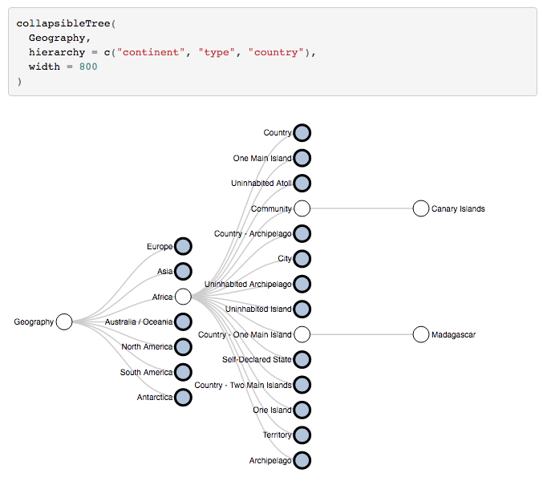

# Research

<br>

## Multi-armed bayesian bandit for Email Send Time Optimization

The objective of building a reliable Send Time Optimization (STO) engine is the following: send emails to each of the customers with the best possible timing when the customers are the most receptive. Some subscribers prefer to receive newsletters early in the morning, others take the time to scan their inboxes in the evening.  From the sender’s point of view, it is desirable to always deliver at the right time. 

Deciding which timeslot is the the most effective one to send promotional emails is a huge challenge for many companies. 

One common approach is to choose different send times and measure the Open Rate (OR) of the emails for each timeslot. At some point, when the measured OR for one specific slot exceeds that of the other slots, we will switch to the one with the highest for all users. Algorithms for solving this problem are called bandit algorithms. For my analysis I chose a **Multi-Armed Bayesian Bandit Algorithm**. 
<br>


$$\min_x f_{\text{logistic}}(x):= \sum_{i=1}^m\left\{\log\left(1+\exp{\left\langle f^i, x\right\rangle}\right) - s^i\left\langle f^i,x\right\rangle\right\} + \frac{\lambda}{2}\|x\|^2,$$
 


```Latex
$\text{S}_1(N) = \sum_{p=1}^N \text{E}(p)$
```



The translation $[\![e]\!]$ given by


### math (start with bayesian) stucchio
### steps algorithm (Sto)
### application to email campaign (STO)
### math (STO)
### results (Pulls and OR)


<br>
<br>


